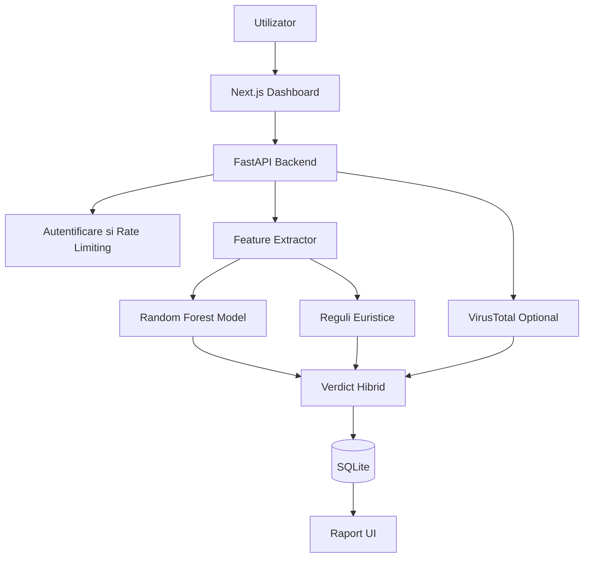

# Raport Final: Sistem Hibrid de Analiza si Clasificare Automata a Amenintarilor Cibernetice bazat pe URL-uri

## 1. Obiectivul Proiectului

Obiectivul proiectului este dezvoltarea unei aplicatii locale care analizeaza URL-uri si ofera un verdict de securitate: `safe`, `suspicious`, `dangerous` sau `unknown`.

Sistemul combina trei surse de decizie:

- un model local de Machine Learning;
- reguli euristice explicabile;
- VirusTotal ca referinta externa optionala.

Aplicatia nu acceseaza site-urile analizate si nu descarca continut din ele. Ea lucreaza cu textul URL-ului si cu reputatia externa oferita de VirusTotal atunci cand cheia API este configurata.

## 2. Problema Rezolvata

Atacurile de tip phishing, malware si defacement folosesc frecvent linkuri care incearca sa para legitime. Exemple comune sunt domenii false, subdomenii inselatoare, cuvinte precum `login`, `verify`, `paypal` sau adrese care imita domenii cunoscute.

Proiectul rezolva aceasta problema printr-un sistem care:

- extrage indicatori numerici din URL;
- foloseste un model ML pentru predictie rapida;
- aplica reguli de siguranta pentru cazuri cunoscute;
- compara rezultatul local cu VirusTotal;
- salveaza un raport explicabil pentru fiecare scanare.

## 3. Arhitectura Sistemului



Componente principale:

- `FastAPI` pentru API backend;
- `Next.js` pentru interfata web;
- `SQLite` pentru stocarea rapoartelor;
- `scikit-learn` pentru modelul Random Forest;
- `VirusTotal API v3` pentru verificare externa;
- `SQLAlchemy` si `Alembic` pentru persistenta si schema.

## 4. Feature Engineering

URL-ul brut este transformat intr-un set de indicatori numerici. Exemple de indicatori:

- lungimea URL-ului;
- lungimea domeniului;
- numarul de puncte din domeniu;
- prezenta `https`;
- prezenta unei scheme lipsa;
- raportul cifrelor;
- numarul parametrilor din query string;
- cuvinte suspecte;
- apartenenta domeniului in whitelist;
- semnal pentru homepage-uri sigure de tip root sau `www`;
- semnal pentru pagini publice normale, de exemplu Google Search, YouTube Watch, GitHub repository sau Wikipedia article;
- semnal pentru servicii trusted dar user-generated, de exemplu Google Forms, Google Docs, Google Sites sau redirecturi YouTube;
- domeniu de tip IP;
- simbol `@`;
- domeniu cu cratima;
- punycode;
- extensii riscante precum `.exe`, `.zip`, `.js`;
- URL shortener;
- entropia URL-ului.

Aceasta etapa este importanta deoarece transforma textul intr-o forma matematica pe care modelul o poate procesa.

## 5. Modelul de Machine Learning

Modelul local este un `RandomForestClassifier`. El este antrenat pe dataset-ul `malicious_phish.csv`, care contine exemple etichetate ca:

- `benign`;
- `phishing`;
- `malware`;
- `defacement`.

Modelul produce un semnal local:

- eticheta prezisa;
- increderea modelului;
- statusul modelului.

In interfata acest rezultat este prezentat ca `model-only signal`, nu ca verdict final. Increderea modelului nu reprezinta adevar absolut. Ea este probabilitatea interna a modelului pentru clasa aleasa.

## 6. Auditul Datelor si Corectia Curata

In timpul testarii a aparut o problema importanta: URL-uri legitime precum `https://google.com` sau o cautare Google normala puteau primi semnal local de tip `phishing`.

Analiza dataset-ului a aratat cauza:

- dataset-ul continea multe exemple bune si multe exemple rele;
- dar pentru domenii trusted + HTTPS, exemplele erau aproape doar `phishing` sau `malware`;
- pentru Google + HTTPS, auditul local a gasit 0 exemple benign in acea zona a dataset-ului.

Pe scurt, modelul a invatat din date o asociere gresita:

```text
trusted domain + HTTPS + URL complex = posibil phishing
```

Solutia nu a fost stergerea exemplelor rele, deoarece platformele trusted pot fi abuzate prin formulare, documente partajate sau redirecturi. Solutia a fost:

- pastrarea dataset-ului original;
- adaugarea fisierului `data/raw/curated_benign_trusted_urls.csv` cu exemple benign verificate manual;
- adaugarea unor features noi care separa paginile publice normale de serviciile trusted user-generated.

Aceasta abordare este mai buna decat un whitelist simplu, deoarece nu spune ca orice URL Google este automat sigur.

## 7. Evaluare

Modelul proaspat antrenat are urmatoarele rezultate:

| Metrica | Valoare |
| --- | ---: |
| Randuri folosite | 640,905 |
| Accuracy | 93.47% |
| Macro F1 | 91.53% |
| Weighted F1 | 93.62% |

Formula pentru acuratete:

```text
Accuracy = (TP + TN) / (TP + TN + FP + FN)
```

Aplicatia include o pagina `Model` unde aceste rezultate sunt afisate intr-o forma usor de explicat: metrici generale, distributie pe clase, matrice de confuzie si limitari.

## 8. Logica Hibrida

Doar modelul ML nu este suficient. Unele URL-uri legitime, cum ar fi cautarile Google sau linkurile YouTube, pot fi complexe si pot fi clasificate gresit.

De aceea proiectul include un strat hibrid:

- whitelist pe domeniul inregistrat, nu doar pe textul brut;
- protectie impotriva domeniilor false, de exemplu `google.com.fake-domain.ru`;
- scor de risc bazat pe model, reguli si VirusTotal;
- explicatii pentru fiecare verdict.

Exemplu:

```text
https://www.google.com/search?q=university+project
```

poate ramane `safe` daca domeniul inregistrat este `google.com` si VirusTotal nu raporteaza detectii malicious.

In schimb:

```text
https://google.com.fake-domain.ru/login
```

este considerat periculos deoarece domeniul real este `fake-domain.ru`, nu `google.com`.

## 9. Integrarea VirusTotal

VirusTotal este folosit ca referinta externa optionala, nu ca adevar absolut.

Statusuri posibile:

- `skipped`: verificarea a fost dezactivata;
- `not_configured`: nu exista cheie API;
- `cached`: s-a refolosit un rezultat local;
- `fetched`: VirusTotal a returnat un raport;
- `not_found`: nu exista raport;
- `pending`: URL-ul a fost trimis spre analiza;
- `rate_limited`: limita API a fost atinsa;
- `failed`: cererea a esuat;
- `malformed_response`: raspunsul nu a putut fi folosit.

Aceasta abordare pastreaza aplicatia functionala chiar si fara cheie API.

### 9.1. Metrica de Comparatie cu VirusTotal

Aplicatia calculeaza si o rata de acord intre modelul local si VirusTotal.
Aceasta metrica foloseste doar scanarile unde VirusTotal a returnat statistici
de analiza prin statusurile `fetched` sau `cached`.

Semnalul modelului local este considerat:

- `riscant` pentru predictii `phishing`, `malware` sau `defacement`;
- `curat` pentru predictia `benign`.

Semnalul VirusTotal este considerat:

- `riscant` daca exista cel putin o detectie `malicious` sau `suspicious`;
- `curat` daca ambele valori sunt zero.

Formula este:

```text
Rata de acord = Numar acorduri / Numar scanari eligibile
```

Aceasta nu reprezinta adevar absolut. VirusTotal este o referinta externa, nu
un oracol. De aceea aplicatia foloseste termeni precum `acord`,
`dezacord`, `model riscant / VirusTotal curat` si
`model curat / VirusTotal riscant`, nu promite ca fiecare diferenta este un
False Positive sau False Negative real.

## 10. Interfata Web

Interfata contine:

- login admin;
- dashboard cu statistici;
- formular de scanare URL;
- lista de rapoarte;
- cautare si filtrare rapoarte;
- pagina detaliata pentru fiecare raport;
- pagina cu metricile modelului;
- comparatie intre modelul local si VirusTotal.

Rapoartele afiseaza URL-urile in forma defanged, de exemplu:

```text
hxxps://google[.]com
```

Acest lucru reduce riscul ca utilizatorul sa dea click accidental pe un link periculos.

## 11. Securitate

Masuri implementate:

- cookie de sesiune `HttpOnly`;
- logout;
- limitare incercari login;
- limitare scanari;
- validare origin pentru cereri care modifica date;
- limita pentru marimea request body;
- security headers;
- afisare defanged pentru URL-uri.

Aplicatia este gandita pentru rulare locala in cadrul proiectului universitar, nu pentru deployment enterprise multi-user.

## 12. Testare

Testarea include:

- teste unitare pentru feature extractor;
- teste pentru logica de verdict;
- teste pentru clientul VirusTotal cu raspunsuri mock;
- teste API pentru autentificare, scanari, statistici, rate limit si erori;
- verificare frontend prin `pnpm lint` si `pnpm build`;
- ghid manual de testare UI.

Comenzi:

```bash
cd backend
uv run ruff check
uv run pytest

cd ../frontend
pnpm lint
pnpm build
```

## 13. Limitari

Limitari cunoscute:

- modelul analizeaza textul URL-ului, nu continutul paginii;
- VirusTotal nu trebuie tratat ca adevar absolut;
- rate limiting-ul este in memorie si se reseteaza la restart;
- aplicatia are un singur admin;
- modelul trebuie reantrenat pentru atacuri noi;
- webhook-urile pentru email, Slack, Telegram sau WhatsApp sunt in afara versiunii v1.
- fisierul mare al modelului `models/url_classifier.skops` este livrat separat fata de codul sursa.

## 14. Directii Viitoare

Extensii posibile:

- integrare email;
- integrare Telegram sau Slack;
- conturi multiple;
- rate limiting cu Redis;
- deployment cu baza de date externa;
- colectare feedback pentru imbunatatirea modelului;
- retraining periodic;
- grafice pentru evolutia amenintarilor.

## 15. Materiale de Prezentare

Proiectul include materiale pentru prezentare si predare:

- `docs/screenshots/` contine capturi din aplicatie;
- `docs/demo-script.md` contine pasii pentru demonstratie;
- `docs/code-reading-guide.md` explica ordinea recomandata de citire a codului;
- `deliverables/url-threat-checker-university-demo.pptx` este prezentarea PowerPoint;
- `docs/handoff-package.md` explica ce fisiere trebuie predate.

Capturile recomandate pentru raport:

- `docs/screenshots/02-dashboard.png` pentru dashboard;
- `docs/screenshots/05-dangerous-report.png` pentru raportul unui URL periculos;
- `docs/screenshots/07-model-page.png` pentru metricile modelului.

## 16. Concluzie

Proiectul demonstreaza o solutie completa si explicabila pentru analiza URL-urilor suspecte. Valoarea principala nu este doar antrenarea unui model ML, ci integrarea lui intr-un sistem real: API, dashboard, persistenta, reguli euristice, securitate locala si comparatie cu o sursa externa precum VirusTotal.
